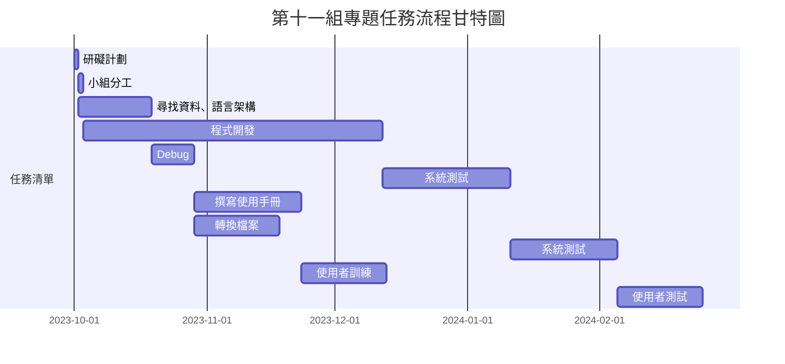

# No.11
系統分析 專題小組討論

```mermaid
gantt
    title 第十一組專題任務流程甘特圖

    section 任務清單
    研礙計劃           :a1, 2023-10-01, 1d
    小組分工          :a2, after a1  , 1d
    尋找資料、語言架構           :a3, after a1  , 17d
    程式開發           :a4, after a2  , 70d
    Debug           :a5, after a3  , 10d
    系統測試      :a6, after a4  , 30d
    撰寫使用手冊        :a7, after a5  , 25d
    轉換檔案           :a8, after a5  , 20d
    系統測試           :a9, after a6  , 25d
    使用者訓練         :a10, after a7  , 20d
    使用者測試         :a11, after a9  , 20d
```
