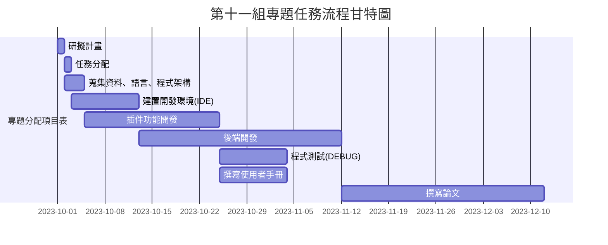

# No.11 系統分析 專題小組討論

## 分配圖

## 甘特圖

```mermaid
gantt
    title 第十一組專題任務流程甘特圖

    section 專題分配項目表
    研擬計畫           :a1, 2023-10-01, 1d
    任務分配          :a2, after a1  , 1d
    蒐集資料、語言、程式架構           :a3, after a1  , 3d
    建置開發環境(IDE)           :a4, after a2  , 10d
    插件功能開發           :a5, after a3  , 20d
    後端開發      :a6, after a4  , 30d
    程式測試(DEBUG)        :a7, after a5  , 10d
    撰寫使用者手冊           :a8, after a5  , 10d
    撰寫論文           :a9, after a6  , 30d
```

## PERT圖

## 關鍵路徑
1>2>3>4>6>7>9

